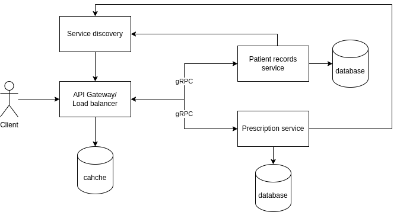

# Healthcare app for patient records and prescription management

### Reasons why the healthcare app is a good fit for microservices:
- Complex application: Healthcare apps are typically complex applications with multiple components, such as patient records, prescription management, appointment scheduling, and telemedicine. Microservices architecture can help to simplify the development and maintenance of such applications by breaking them down into smaller, more manageable services.
- Independent development and maintenance: Each microservice can be developed and maintained independently, which can lead to faster development cycles and easier updates. This is especially important for healthcare apps, where new features and updates are needed frequently to meet the changing needs of patients and providers.
- Scalability and resilience: Microservices architectures are more scalable and resilient than traditional monolithic architectures. If one microservice fails, it does not bring down the entire application. Additionally, microservices can be scaled up or down independently to meet changing demand.

### Real-world examples of well-known projects that are similar and employ microservices:
- Amazon Web Services (AWS): AWS offers a wide range of microservices-based healthcare solutions, such as Amazon HealthLake, Amazon Comprehend Medical, and Amazon Transcribe Medical.
- Google Cloud Platform (GCP): GCP also offers a number of microservices-based healthcare solutions, such as Google Cloud Healthcare API and Google Cloud Healthcare Data Engine.
Microsoft Azure: Azure offers a variety of microservices-based healthcare solutions, such as Azure Healthcare API and Azure Synapse Analytics.
- Allscripts Sunrise: Allscripts Sunrise is a cloud-based electronic health record (EHR) system that uses microservices architecture.
- Epic MyChart: Epic MyChart is a patient portal that uses microservices architecture to provide patients with access to their health records and other healthcare services.

## Service boundaries:
- Patient Records Service: Manages patient health records, including medical history, diagnoses, and treatment plans. 
- Prescription Management Service: This microservice is responsible for managing prescriptions and send prescription to mail.



## Technology stack
I have chosen to use Python for the microservices and Node.js for the API gateway. Python is a popular language for microservices because it is easy to learn, has a large and active community, and has a rich ecosystem of libraries and frameworks. JavaScript is a good choice for the API gateway because it is fast and lightweight, and it is well-suited for building web-based applications.

## Communication pattern

The communication between the client and the API Gateway will be synchronous (RESTful API). The API gateway and the microservices will communicate using the RPC pattern from gRPC. gRPC uses a communication pattern that revolves around defining and invoking methods on remote services as if they were local procedures or functions.

## Data Management
One way to manage data across microservices is to use separate databases for each service. This approach has a number of advantages:
- It simplifies the design and implementation of each microservice.
- It allows each microservice to scale independently.
- It improves the isolation and security of each microservice.

### Endpoints
For the gateway\
GET /records/{patient_id}: Get the patient records for the given patient ID.\
POST /records: Create a new patient record.\
PUT /records/{record_id}: Update the patient record for the given patient ID.\
DELETE /records/{record_id}: Delete the patient record for the given patient ID.\

GET /prescriptions/{patient_id}: Get all of the prescriptions for the given patient ID.\
POST /prescriptions: Create a new prescription.\
PUT /prescriptions/{prescription_id}: Update the prescription for the given prescription ID.\
DELETE /prescriptions/{prescription_id}: Delete the prescription for the given prescription ID.

- Patient Records Service:\

get_patient_records\
post_patient_records\
put_patient_records\
delete_patient_records\
check_health

- Prescription Management Service:\

get_patient_prescription\
post_patient_prescription\
put_patient_prescription\
delete_patient_prescription\
check_health

## Data to be transferred:
```proto
message PatientRecord {
  int32 record_id = 1;
  int32 patient_id = 2;
  int32 doctor_id = 3;
  string record_text = 4;
  string date = 5;
  }

message Medication {
  string medication_name = 1;
  string dosage = 2;
  }

message Prescription {
  int32 prescription_id = 1;
  int32 patient_id = 2;
  int32 doctor_id = 3;
  repeated Medication medications = 4;

message PatientRecordRequest {
  int32 record_id = 1;
  int32 patient_id = 2;
}

message PrescriptionRequest {
  int32 prescription_id = 1;
  int32 patient_id = 2;
}

message HealthStatus {
  bool is_healthy = 1;
}

message ServiceRegistrationInfo {
  string service_name = 1;
  string ip_address = 2;
  int32 port = 3;
  string metadata = 4;
}

<!-- Example of usage -->
service PrescriptionManagementService {
  rpc GetPatientPrescriptions (PatientRequest) returns (Prescription);
  rpc PostPatientPrescription (Prescription) returns (Prescription);
  rpc PutPatientPrescription (Prescription) returns (Prescription);
  rpc DeletePatientPrescription (PrescriptionRequest) returns (google.protobuf.Empty);
}
```

## Deployment and Scaling
Containerization is a technology that allows you to package the microservices into self-contained units called containers. Docker will be used because it  is a popular containerization platform. Docker allows you to build, run, and share containers.

